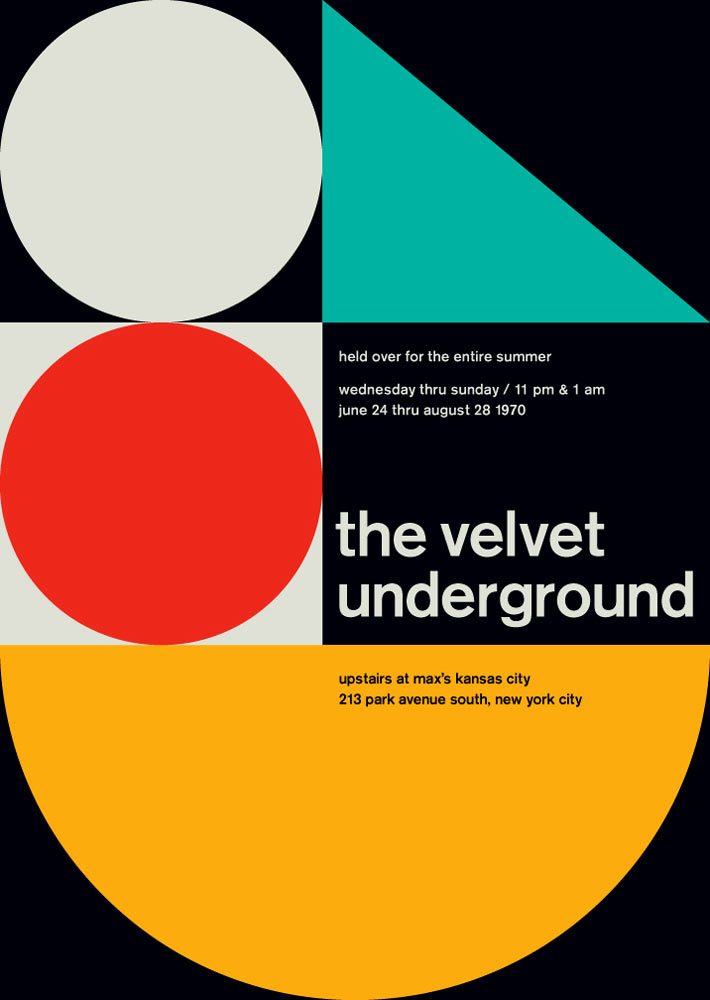
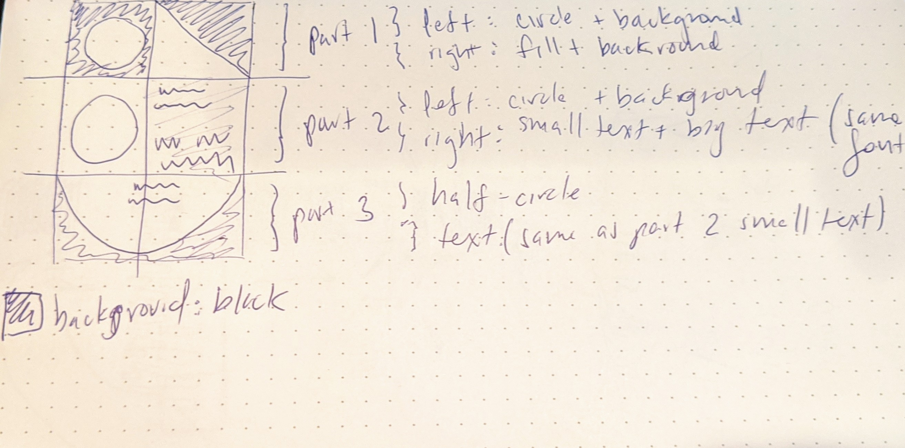

# Dynamic Web Development 
## Assignment 2
***

This repository contains my second assignment for the Dynamic Web Development Class at ITP. The assignment contains a simple web page with an interactive swiss-style poster made in CSS, HTML, and JS.

## About
***

This project consists on making a webpage with CSS, HTML, and JS together in order to get a good idea on how to manage content through CSS and it's flex layout. I decided to use Mike Joyce's vintage print which re-imagines the original Velvet Underground at Max's Kansas City concert.

## Setup
***

 - To open the webpage you can download the files included in the repository and run the **index.html** file in the root folder.

### Prerequisites

 -  An internet browser.

### Installation

For this particular project, there are no specific installation requirements.

### Develop

To develop this document, you can follow the steps provided below:
1. Create a fork of this project on Github
2. Ping the author of this repo via Github Issues to see if they are looking for contributions on the specific feature you're looking to add
3. Open the file in VS Code and make updates 
4. Add and commit those changes in your forked github repo
5. Make a pull request specifying what additions and changes were made
6. Have a nice chat and communication with me about those changes. 
7. Celebrate the contribution! 

## Built with
***
* [VS Code](https://code.visualstudio.com/)
* [Github](https://github.com)

## Author
***
* [Alvaro Lacouture](https://alvarolacouture.com) 

## Acknowledgements
***
* [Joey Lee](https://jk-lee.com) -- adjunct professor -- [NYU ITP](https://itp.nyu.edu)
* [Cassie Tarakajian](https://cassietarakajian.com/) -- adjunct professor -- [NYU ITP](https://itp.nyu.edu)
* [The Good Project Readme Project](https://github.com/itp-dwd/2020-spring/blob/master/templates/readme-template.md)
* [Paulund](https://paulund.co.uk/how-to-create-different-shapes-in-css)

***
# Notes & Process

## Process & Documentation

I started by making a sketch to identify the main parts in the poster. I found three main areas, the top, the middle, and the bottom. The top and middle areas had a similar two column layout with geometry and text, and the bottom area was a full half circle with some text layed out in the same position as the superior sections.

As we can see in the images above, the layout was not symmetrical. However, I decided to maintain a vertical symmetry because of my own taste.This can be modifiec at any time in the height parameter of the classes in CSS. In any case, I started by creating my three main areas. My top, middle, and bottom classes in CSS.

I then proceeded to define the sections inside of each area. There was a different circle for each of the top and middle sections, as well as a triangle only present for the top section. The text visible in the middle area contained a small text and a larger, title text. The bottom area contained the same small text as the middle area on top of a big half circle.

 As such, there would be a general **circle class**, a **specific circle class** for each of the areas (including the bottom area's half circle), a **triangle class**, and a **content** class which would include the **small text** and/or the **title text**. I then proceeded to create each of these classes

After I finished with the layout structure and the main geometries in place, I focused on each of the texts. First I did the middle texts and then I proceeded with the bottom texts. I left the font for the end, using an online tool to identify the font.

Finally, with the text in the HTML structure I could organize it inside the poster to fit the target layout.

The only thing left to do was to add some interactions intergrated with JS.

## Challenges & Struggles

## Questions

## References

